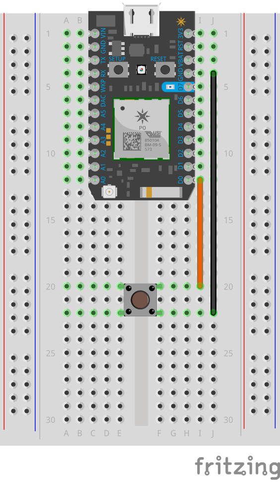

[](https://po-util.com)

# Lesson 1: Introduction to the Particle Photon

The Particle Photon is a programmable microprocessor board that is great for IoT (Internet of Things) projects.

It can be programmed in several ways, but the recommended way to program it (by Nathan) is to use Atom and po.
More about that soon.

Much like Arduino, every Photon sketch must contain a `setup()` function and a `loop()` function. `setup()` runs once when the Photon is powered up (via USB, battery, etc.), and `loop()` continuously runs repeatedly after `setup()` until the Photon is powered down.

At a low level, the Photon's behavior can be summarized as the control of its pins. There are many pins on the Photon, and many of them can be controlled by programs to do different functions.

Two common tasks that the Photon can do with all of its programmable pins (D0-D7 & A0-TX) are digital output and digital input. Digital output is either 0 volts or 3.3 volts. Digital input is LOW when the voltage is closer to 0 volts, and HIGH when the voltage is closer to 3.3 volts. Digital output and input are used to turn a component on or off, or determine if a component is emitting HIGH or LOW voltage.

***

### Circuit Diagram:



## Part 1: Intro

A common usage of digital output is turning an LED on or off. Here is an example of code that would turn on the built-in LED on the Photon that is soldered to pin D7 (This code can be found in `setup()` in this lesson's code):

```
pinMode(D7, OUTPUT);
digitalWrite(D7, HIGH);
```

* The first line of code `pinMode(D7, OUTPUT);` instructs the Photon to initialize pin D7, setting it as an OUTPUT.
* The second line of code `digitalWrite(D7, HIGH);` instructs the Photon to write the HIGH value to D7, a digital output operation.

## Part 2: Blink

Now that we know how to turn the D7 LED, let's make it blink on and off every second.

In `setup()` there is the following:

```
pinMode(D7, OUTPUT);
```

* This makes D7 an OUTPUT just like the last part.

In `loop()` there is the following:

```
digitalWrite(D7, HIGH);
delay(1000);
digitalWrite(D7, LOW);
delay(1000);
```

This block of code consists of four instructions.

* The first, `digitalWrite(D7, HIGH);` turns on the D7 LED just like the last part.
* The second, `delay(1000);` tells the Photon to delay for 1000 milliseconds. This makes the Photon wait a second before doing anything else.
* The third, `digitalWrite(D7, LOW);` turns the D7 LED off after the 1 second from the previous instruction has passed. The delay is important because without it, the LED would switch from on to off virtually instantly and we wouldn't be able to see it.
* The fourth, `delay(1000);` waits 1 second again, letting the LED stay off for a second to create the blink animation.

## Part 3: Button -> LED

Let's throw a button into the mix. With this part the D7 LED will turn on when the button is pressed and will turn off when the button is not pressed.

Wire a button (momentary switch) between D0 and GND. (Check the included diagram.)

In `setup()` there is the following:

```
pinMode(D7, OUTPUT);
pinMode(D0, INPUT_PULLUP);
```

* The first line sets D7 and OUTPUT like the last two parts.
* The second line sets D0 as a INPUT_PULLUP, which means that when the button is wired and is pressed, the pin will be LOW, otherwise the pin will be HIGH.

In `loop()` there is the following:

```
if ( digitalRead(D0) == LOW ) {
  digitalWrite(D7, HIGH);
}
else {
  digitalWrite(D7, LOW);
}
```

This is an if-else statement, checking whether `digitalRead(D0) == LOW`, meaning that the Photon does a digital input operation on pin D0. If the pin is LOW, then the button is pressed. If `digitalRead(D0) == LOW`, the Photon will do `digitalWrite(D7, HIGH);`, which turns the D7 LED on. If the pin is HIGH, then the button is not pressed, and the Photon will turn the D7 LED off using `digitalWrite(D7, LOW);`.

## Conclusion:

In this lesson we were introduced to digital outputs and inputs using the built-in D7 LED, and a button. We made the LED turn on and blink, and we made the LED turn on when we held the button.
