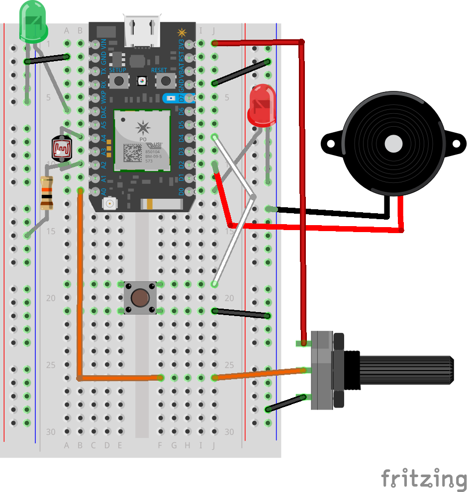

[](https://po-util.com)

# Lesson 2: Analog Input and Output

The Particle Photon can do analog input on pins A0-A7. When the Photon does analog input it reads the voltage of an analog pin (0 volts to 3.3 volts) and can store the voltage reading as an integer between 0 and 4095.

The Photon can do true analog output on two pins: DAC1 and DAC2 (A6 and A3). On these pins the Photon can write a value between 0 and 4095 to set the voltage to a value between 0 and 3.3 volts.

The Photon can do PWM (Pulse Width Modulation) on any PWM capable pin (D0-D3, A4-A5, WKP-TX). PWM is not true analog output, but it suffices for many applications like controlling the brightness of LEDs, speeds of motors, and creating tones with buzzers.

For PWM the Photon can write a value between 0 and 255 to a PWM pin to control the digital pulse. (0 corresponds to always off and 255 corresponds to always on).

***

### Circuit Diagram



## Part 1: Analog Output with DAC

The Photon can do true analog output on two pins: DAC1 and DAC2 (A6 and A3). On these pins the Photon can write a value between 0 and 4095 to set the voltage to a value between 0 and 3.3 volts.

There should be an LED wired between A6 (DAC) and GND.

In `setup()` there is the following:

```
pinMode(A6, OUTPUT);
analogWrite(A6, 2500);
```

* The first instruction, `pinMode(A6, OUTPUT);` sets A6 as an output.
* The second instruction, `analogWrite(A6, 2500);` writes the analog value of 2500 (2.0146 volts) to pin A6, turning on the LED.

## Part 2: Analog Output with PWM

The Photon can do PWM (Pulse Width Modulation) on any PWM capable pin (D0-D3, A4-A5, WKP-TX). PWM is not true analog output, but it suffices for many applications like controlling the brightness of LEDs, speeds of motors, and creating tones with buzzers.

For PWM the Photon can write a value between 0 and 255 to a PWM pin to control the digital pulse. (0 corresponds to always off and 255 corresponds to always on).

There should be an LED wired between D0 and GND.

In `setup()` there is the following:

```
pinMode(D0, OUTPUT);
analogWrite(D0, 5);
```

* The first line `pinMode(D0, OUTPUT);` sets D0 as an OUTPUT.
* The second line `analogWrite(D0, 5);` writes the PWM value of 5 to pin D0.

## Part 3: Analog Output with a Buzzer

Let's use something we learned in the last unit. Wire a button between D4 and GND. We will use it as a digital input.

We're going to also use a piezo buzzer. Wire it between D2 and GND.

In `setup()` there is the following:

```
pinMode(D4, INPUT_PULLUP);
pinMode(D2, OUTPUT);
```

* The first line sets the button on D4 to a digital input.
* The second line sets the buzzer on D2 to an output.

In `loop()` there is the following:

```
if ( digitalRead(D4) == LOW ) {
  analogWrite(D2, 150);
}
else {
  analogWrite(D2, 0);
}
```

* When the button is pressed, ( `digitalRead(D4) == LOW` ), the Photon will write the PWM value of 150 to the buzzer.
* When the button is not pressed, the Photon will turn off the buzzer.

## Part 4: Analog Input from a Potentiometer

The Photon can do analog input on pins A0-A7. When the Photon does analog input it reads the voltage of an analog pin (0 volts to 3.3 volts) and can store the voltage reading as an integer between 0 and 4095.

The Photon can use a potentiometer to get an analog reading. We'll write the value of this reading to the LED wired to A6 (DAC).

There should be a potentiometer wired to A0.

In `setup()` there is the following:

```
pinMode(A0, INPUT);
pinMode(A6, OUTPUT);
```

* The first line sets the potentiometer pin as an analog INPUT.
* The second line sets the LED pin as an OUTPUT.

In `loop()` there is the following:

```
int potReading = analogRead(A0);
analogWrite(A6, potReading);
```

* The first instruction creates a variable called `potReading` and stores the analog reading of the potentiometer to it.
* The second instruction writes the reading to the LED connected to A6.

When the potentiometer knob is rotated the brightness of the LED will change.

## Part 5: Analog Input from a Photo-resistor

Much like how the Photon got analog readings from the potentiometer, it can get analog readings from a photo-resistor.

There should be a photo-resistor wired between A4 and A2, and to GND. (Check the circuit diagram.) A4 will power the photo-resistor. A2 will get the readings.

The readings will printed to the serial monitor.

In `setup()` there is the following:

```
pinMode(A4, OUTPUT);
digitalWrite(A4, HIGH);
pinMode(A2, INPUT);
Serial.begin(115200);
```

* The first line sets A4 as an OUTPUT.
* The second line turns on A4 so that it can power the photo-resistor.
* The third line sets A2 as analog input.
* The fourth line starts the serial monitor.

In `loop()` there is the following:

```
int lightReading = analogRead(A2);
Serial.printlnf("lightReading: %d", lightReading);
```

* The first line creates a variable called `lightReading` and stores the analog reading of the photo-resistor to it.
* The second line prints the value of the `lightReading` variable to the serial monitor. The output looks similar to this:

```
lightReading: 2679
```

If you open a serial monitor you will get the output. The easiest way to open a serial monitor is to use the following command in Terminal:

```
particle serial monitor
```

You should see a lot of output coming in quickly through the serial monitor. You can press (CTRL-C) to close the serial monitor.

## Conclusion:

In this lesson we were introduced to analog inputs and outputs using LEDs, a buzzer, a potentiometer and a photo-resistor.

We learned that DAC can be used to do true analog output operations on pins and use it to control the brightness of an LED, and that PWM (Pulse Width Modulation) can be used to control the brightness of the LED and make noise with a buzzer.

We learned how to take analog readings from a potentiometer and write those values to an LED.

We also learned how to take analog readings from a photo-resistor and print them to the serial monitor.
