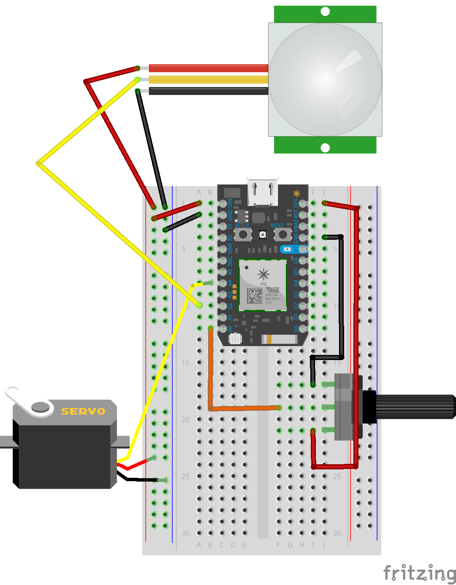

[](https://po-util.com)

# Lesson 3: Advanced I/O

In this lesson we'll be looking at a few types of advanced input and output. We'll control a servo motor by reading a potentiometer, and we'll detect movement with a PIR sensor.

***

### Circuit Diagram



## Part 1: Servo

In this lesson we'll use a servo and a potentiometer. When we rotate the potentiometer the servo will rotate.

The servo will be wired to pin A4. The potentiometer will be an analog input and will be wired to pin A0.

Above `setup()` there is the following:

```
Servo myservo;
```

* This creates `myservo` an object of the `Servo` class. We can use this object to interact with the servo.

In `setup()` there is the following:

```
myservo.attach(A4);
pinMode(A0, INPUT);
```

* The first line initializes the servo on pin A4.
* The second line sets A0 as an input.

In `loop()` there is the following:

```
int reading = analogRead(A0);
int position = map(reading, 0, 4095, 0, 180);
myservo.write(position);
```

* The first line takes an analog reading from the potentiometer on pin A0 and stores it to the `reading` variable.
* The second line maps the `reading` variable, maps it to a value between 0 and 180 and stores it to the `position` variable.
* The third line writes the value of the `position` variable (0 to 180) to the servo, moving it to an angle between 0 and 180 degrees.

## Part 2: PIR Sensor

A PIR (Passive Infrared) Sensor detects heat movement and excels at detecting the presence of people. In this lesson we'll use a PIR sensor to detect when someone passes by the Photon. The PIR sensor is a digital input that we'll wire to pin A2.

We'll have the Photon turn on the D7 LED and notify us on the serial monitor when motion is detected. When the motion stops, the Photon will turn the light off, and notify us on the serial monitor.

Above `setup()` there is the following:

```
int pirState = LOW;
int val = 0;
```
* The first line creates the `pirState` variable, which is where the motion state is stored.
* The second line creates the `val` variable, which where the digital input reading is stored.

In `setup()` there is the following:

```
pinMode(A2, INPUT);
pinMode(D7, OUTPUT);
Serial.begin(115200);
```

* The first line initializes the PIR pin as an input.
* The second line initializes the D7 LED as an output.
* The third line starts the serial monitor.

In `loop()` we have the following:

```
val = digitalRead(A2);  // read input value
if (val == HIGH) {            // check if the input is HIGH
  digitalWrite(D7, HIGH);  // turn LED ON
  if (pirState == LOW) {
    // we have just turned on
    Serial.println("Motion detected!");
    // We only want to print on the output change, not state
    pirState = HIGH;
  }
} else {
  digitalWrite(D7, LOW); // turn LED OFF
  if (pirState == HIGH){
    // we have just turned of
    Serial.println("Motion ended!");
    // We only want to print on the output change, not state
    pirState = LOW;
  }
}
```

* The Photon reads the PIR pin the check if it is HIGH. If it is, the Photon will turn on the LED. If the state has changed the Photon will print `Motion detected!` to the serial monitor.
* If the PIR is LOW, the Photon will turn off the LED. If the state has changed the Photon will print `Motion ended!` to the serial monitor.

## Conclusion:

In this lesson we began to use more advanced inputs and output. We used a potentiometer to control a servo. We also used a PIR sensor to detect when people move in front of the sensor. The Photon turns on the built-in D7 LED and prints to the serial monitor when there is movement. It turns off the LED and prints to the serial monitor when the movement ends.
