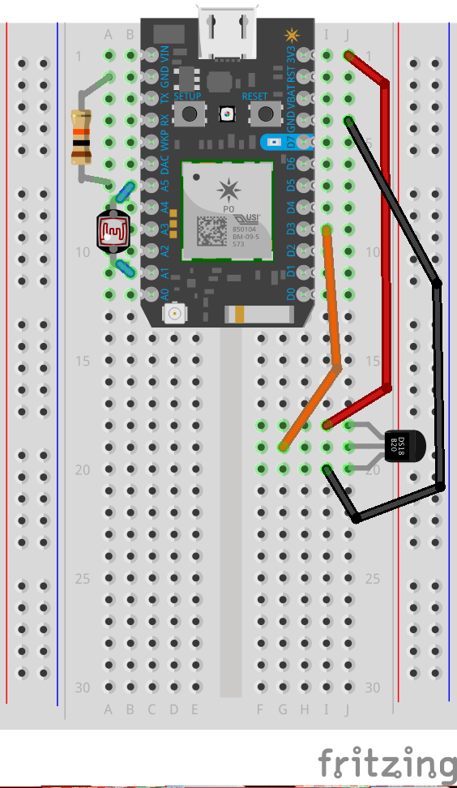

[](https://po-util.com)

# Lesson 5: Particle and Alexa

In this lesson we'll make it possible for Amazon Alexa to get data from the Photon. We'll make it so that you can ask Alexa what the temperature and brightness in the lab are.

For this lesson we'll use a photo-resistor and a thermometer with the Photon. We'll create an Amazon Alexa skill that uses the Particle cloud to retrieve the sensor readings.

We'll make our Amazon Alexa skill using [Storyline](https://getstoryline.com/). Storyline simplifies the Alexa Skill making process by allowing us to create conversations with Alexa. We can create multiple steps in each part of the conversation.

### Storyline Preview:


In the screenshot above we can see the separate blocks in the conversation. There are five blocks: Welcome, Temperature, Brightness, Help, and Stop.

To open the conversation we can say "echo, open Engine", which will open the skill. Alexa will do the instructions in the Welcome Block, and wait for us to reply. We can ask Alexa about the temperature or brightness in the Maine Fab Lab. Depending on if we ask about temperature or brightness, Alexa will then go on to the Temperature Block or the Brightness Block, where Alexa will retrieve sensor data from our Photon using the Particle Cloud.

Alexa is able to retrieve sensor data from the Particle Cloud by using the REST API. Alexa can make requests to the API to get sensor data and the API returns the data in JSON. Here is the response when Alexa asks for the `brightness` variable for example:

```
{
    cmd: "VarReturn",
    name: "brightness",
    result: 60,
    coreInfo: {
        last_app: "",
        last_heard: "2018-05-29T14:03:51.035Z",
        connected: true,
        last_handshake_at: "2018-05-29T13:42:51.472Z",
        deviceID: "40003000104736ABCDEF1234",
        product_id: 6
    }
}
```

The `result` part of the response is the value of the `brightness` variable, and what we have Alexa say in a sentence.

### Circuit Diagram:



### Photon Code:

There are two libraries required to use the thermometer: `spark-dallas-temperature` and `OneWire`. These libraries are included at the top of the sketch.

Before `setup()`: settings are applied, the thermometer object is created, variables are created, and the `softDelay()` utility function is created.

In `setup()`: pins are initialized, the thermometer and serial monitor are initialized, the Particle Cloud variables are initialized, and the Photon connects to the Particle Cloud.

In `loop()`, the brightness is read and converted to a percent, the temperature is read, and the serial monitor prints the results. Readings are only done every 4000 milliseconds because of `softDelay(4000)`. The reason we use `softDelay()` and not `delay()` is that it is non-blocking, meaning that the Photon can still do system processes during the 4000 millisecond pause between readings.
